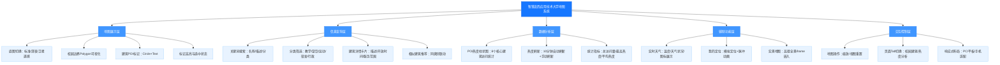

```mermaid
graph TD
    %% 顶层系统
    Root[智慧滇西应用技术大学地图系统]:::root

    %% 五大核心层级
    Layer1[地图展示层]
    Layer2[信息查询层]
    Layer3[数据分析层]
    Layer4[辅助功能层]
    Layer5[交互控制层]

    %% 地图展示层-子功能
    L1_1[底图切换：标准/深夜/卫星遥感]
    L1_2[校园边界Polygon可视化]
    L1_3[建筑POI标记：Circle+Text]
    L1_4[标记高亮与选中状态]

    %% 信息查询层-子功能
    L2_1[关键词搜索：名称/描述/分类]
    L2_2[分类筛选：教学/餐饮/运动/宿舍/行政]
    L2_3[建筑详情卡片：描述/开放时间/服务范围]
    L2_4[相似建筑推荐：同类别联动]

    %% 数据分析层-子功能
    L3_1[POI热度柱状图：8个核心建筑访问统计]
    L3_2[热度刷新：10分钟自动刷新+手动刷新]
    L3_3[统计指标：总访问量/最高热度/平均热度]

    %% 辅助功能层-子功能
    L4_1[实时天气：温度/天气状况/图标展示]
    L4_2[我的定位：模拟定位+脉冲动画]
    L4_3[实景地图：高德全景iframe嵌入]

    %% 交互控制层-子功能
    L5_1[地图操作：缩放/视图重置]
    L5_2[页面Tab切换：校园建筑/热度分析]
    L5_3[响应式布局：PC/平板/手机适配]

    %% 竖向层级关联
    Root --> Layer1
    Root --> Layer2
    Root --> Layer3
    Root --> Layer4
    Root --> Layer5

    Layer1 --> L1_1
    Layer1 --> L1_2
    Layer1 --> L1_3
    Layer1 --> L1_4

    Layer2 --> L2_1
    Layer2 --> L2_2
    Layer2 --> L2_3
    Layer2 --> L2_4

    Layer3 --> L3_1
    Layer3 --> L3_2
    Layer3 --> L3_3

    Layer4 --> L4_1
    Layer4 --> L4_2
    Layer4 --> L4_3

    Layer5 --> L5_1
    Layer5 --> L5_2
    Layer5 --> L5_3

    %% 样式美化
    classDef root fill:#1677ff,color:#fff,stroke:#0958d9
    classDef layer fill:#4096ff,color:#fff,stroke:#1677ff
    classDef item fill:#e8f3ff,color:#333,stroke:#91caff
    class Root root
    class Layer1,Layer2,Layer3,Layer4,Layer5 layer
    class L1_1,L1_2,L1_3,L1_4,L2_1,L2_2,L2_3,L2_4,L3_1,L3_2,L3_3,L4_1,L4_2,L4_3,L5_1,L5_2,L5_3 item

```