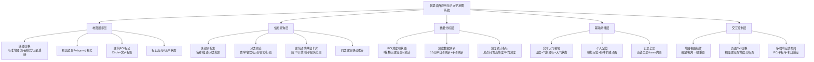

```mermaid
graph TD
    A[智慧滇西应用技术大学地图系统] --> B[地图展示层]
    A --> C[信息查询层]
    A --> D[数据分析层]
    A --> E[辅助功能层]
    A --> F[交互控制层]

    %% 地图展示层子模块
    B --> B1[底图切换<br/>标准地图/深夜模式/卫星遥感]
    B --> B2[校园边界Polygon可视化]
    B --> B3[建筑POI标记<br/>Circle+文字标签]
    B --> B4[标记高亮&选中状态]

    %% 信息查询层子模块
    C --> C1[关键词检索<br/>名称/描述/分类检索]
    C --> C2[分类筛选<br/>教学/餐饮/运动/宿舍/行政]
    C --> C3[建筑详情弹窗卡片<br/>简介/开放时间/服务范围]
    C --> C4[同类建筑联动推荐]

    %% 数据分析层子模块
    D --> D1[POI热度柱状图<br/>8栋核心建筑访问统计]
    D --> D2[热度数据刷新<br/>10分钟自动刷新+手动刷新]
    D --> D3[热度统计指标<br/>总访问/最高热度/平均热度]

    %% 辅助功能层子模块
    E --> E1[实时天气模块<br/>温度+气象图标+天气状态]
    E --> E2[个人定位<br/>模拟定位+脉冲扩散动画]
    E --> E3[实景全景<br/>高德全景iframe内嵌]

    %% 交互控制层子模块
    F --> F1[地图视图操作<br/>缩放/视角一键重置]
    F --> F2[页面Tab切换<br/>校园建筑页/热度分析页]
    F --> F3[多端响应式布局<br/>PC/平板/手机自适应]
```